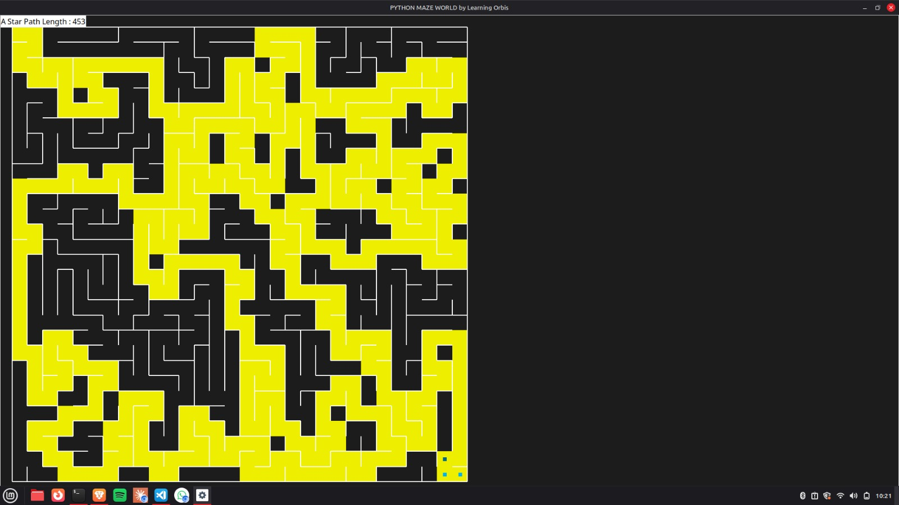

# Shortest-path-Algorithm(A*)
A* Pathfinding Algorithm Visualizer
A visual implementation of the A (A-Star) Search Algorithm* built using Python and the pyamaze library. This project demonstrates how A* finds the optimal path through a randomly generated maze using the Manhattan Distance heuristic.

🧠 Algorithm Overview
A* is an informed search algorithm that finds the shortest path between two nodes using:
f(n) = g(n) + h(n)
TermDescriptionf(n)Total estimated cost of the path through node ng(n)Actual cost from the start node to node nh(n)Heuristic — estimated cost from node n to the goal

Since diagonal movement is not allowed, the heuristic h(n) is calculated using Manhattan Distance:
h = |x1 - x2| + |y1 - y2|

If two nodes share the same f(n) value, the node with the lower h(n) is chosen.

✨ Features

Randomly generated maze of custom size
A* algorithm finds the optimal path
Two animated agents:

🟡 Yellow Agent — traces the path from Start → Goal
⬜ Default Agent — walks the correct path from Goal → Start

Displays the total path length on screen
Uses a Priority Queue for efficient node selection

🛠️ Requirements

Python 3.x
pyamaze library

Install dependencies:
pip install pyamaze

🚀 How to Run
python astar.py
You will be prompted to enter:
Enter the rows: 30
Enter the columns: 30
A maze window will open and the animation will start automatically.

📁 Project Structure
├── astar.py       # Main A* algorithm and visualization
└── README.md      # Project documentation

🔍 How It Works

Maze Generation — A random maze is created using pyamaze
A Execution* — Algorithm runs from bottom-right (rows, cols) to top-left (1,1)
Path Reconstruction — Two paths are built:

fwdPath — Forward path from Start → Goal
revPath — Reverse path from Goal → Start

Visualization — Two agents animate the paths with a small delay

## 📸 Screenshots

### 🟡 Yellow Agent (Start → Goal)

### 🔵 Blue Agent (Goal → Start)

(NOTE: The blue agent will not be able to show the path from the image given it is just for reference. while running the code you can know it)

📊 Example
Enter the rows: 30
Enter the columns: 30
A Star Path Length: 453

📚 References

A* Search Algorithm - Wikipedia
pyamaze Documentation

